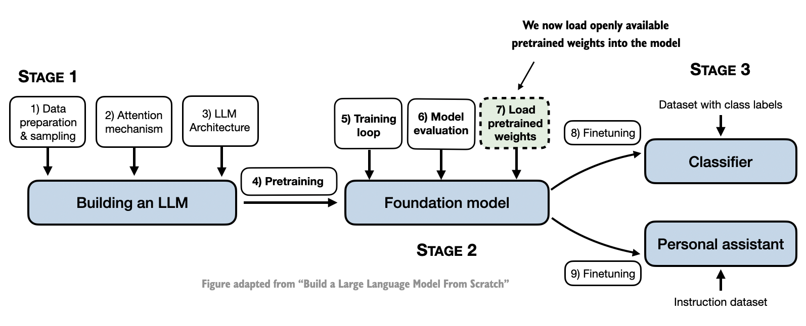
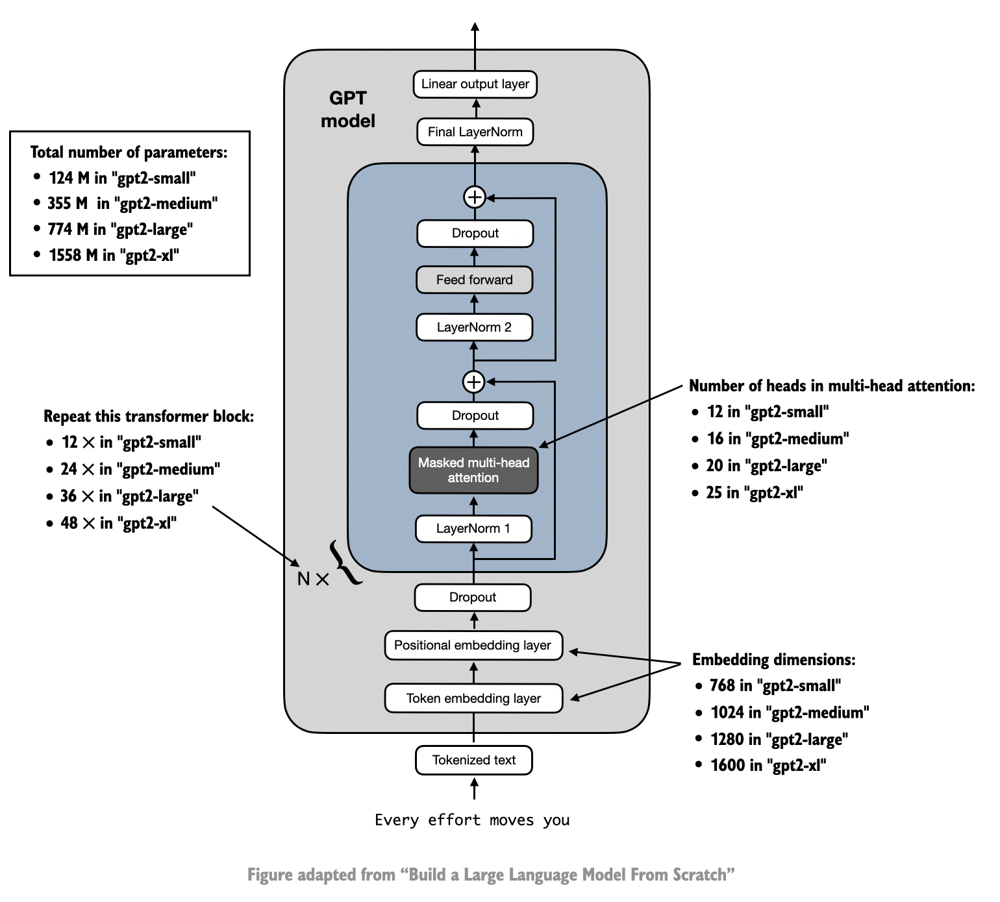
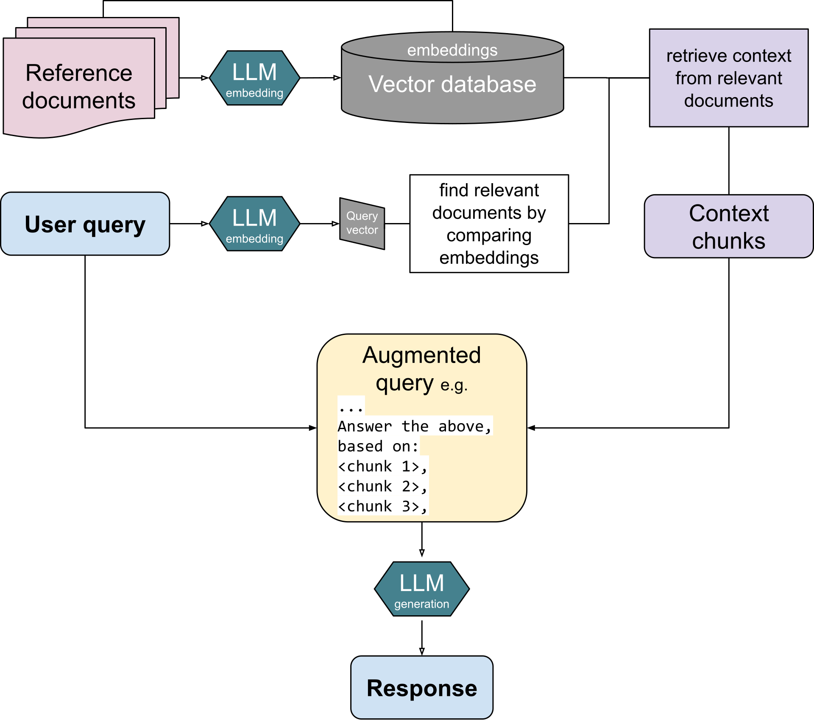

Pretraining/Using Existing/Fine Tuning LLMs
============================================
REF: https://github.com/rasbt/LLM-workshop-2024

Input data preparation:

- Tokenization: it breaks the input text into individual tokens (in general words).
- Vocabulary: Each unique token is added to the vocabulary in alphabetical order which means assigning a unique ID to
  each token.
- These integers token IDs are used as input to LLM.
- Then the sliding window is used for selecting input and target ids.

Models like GPT, Gemma, Phi, Mistral, Llama etc. generate words sequentially and are based on the decoder
part of the original transformer architecture.

Token Embeddings:
Token IDs are simply indices representing words in a vocabulary, while embeddings are rich vector representations that
encode the semantic meaning of those words.
The transition from token IDs to embeddings usually happens in the embedding layer of a neural network, where each ID is
mapped to its corresponding vector.

Positional Embeddings: assigns positional embeddings to each token in the input sequence.

Layers and Attention heads.

Output Layers.

Softmax function.

Steps for Building LLMs
-----------------------

GPT NN Algorithm Architecture
-----------------------------

RAG Architecture(Retrieval Augmented Generation)
================================================
REF: https://en.wikipedia.org/wiki/Retrieval-augmented_generation
------------------

Retrieval augmented generation (RAG) is a technique that grants generative artificial intelligence models information
retrieval capabilities.
It modifies interactions with a large language model (LLM) so that the model responds to user queries with reference to
a specified set of documents,
using this information to augment information drawn from its own vast, static training data.
This allows LLMs to use domain-specific and/or updated information. Use cases include providing chatbot access to
internal company data, or giving factual information only from an authoritative source.

RAG Steps

- Indexing:
  The data to be referenced must first be converted into LLM embeddings, numerical representations in the form of large
  vectors.
  RAG can be used on unstructured (usually text), semi-structured, or structured data (for example knowledge graphs).
  These embeddings are then stored in a vector database to allow for document retrieval.

- Augmentation:
  The model feeds this relevant retrieved information into the LLM via prompt engineering of the user's original
  query.

- Generation:
  Finally, the LLM can generate output based on both the query and the retrieved documents.

Building RAG Application using Claude 3 and Hugging Face
--------------------------------------------------------
REF: https://medium.com/@myscale/building-a-rag-application-in-10-min-with-claude-3-and-hugging-face-10caea4ea293

The Claude 3 family includes three models: Haiku, Sonnet, and Opus, each designed for different needs.
Hugging Face provides a platform where developers can freely share Code, Models, and Datasets for AI and also provides
tools to access them.
Hugging Face is a leading platform known for its extensive library of pre-trained models.

Leveraging Hugging Face’s tools, such as LangChain and Ray, developers can build scalable and high-performance RAG
systems that efficiently handle large-scale data and complex queries.

1. Load relevant data into MyScaleDB(it's a vector database) using HF's embedding models.
2. Now send the query to MyScaleDB and get relevant documents.
3. Connect to Claude-3 anthropic model and send query + relevant documents.

